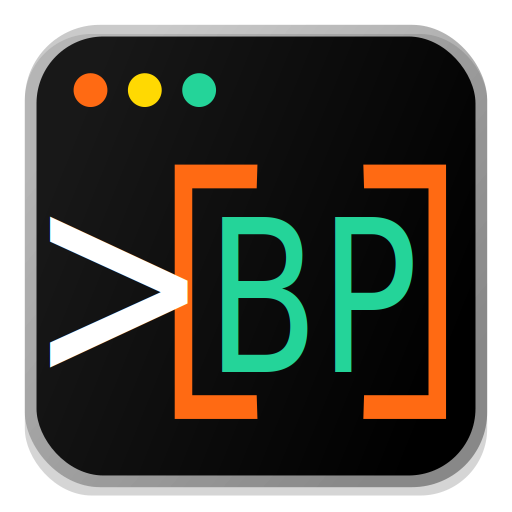
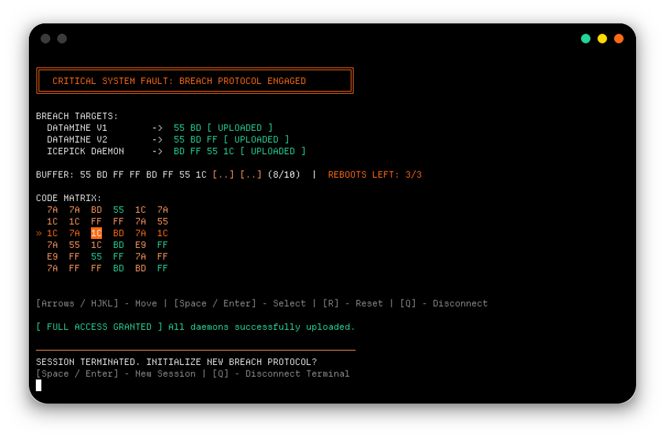
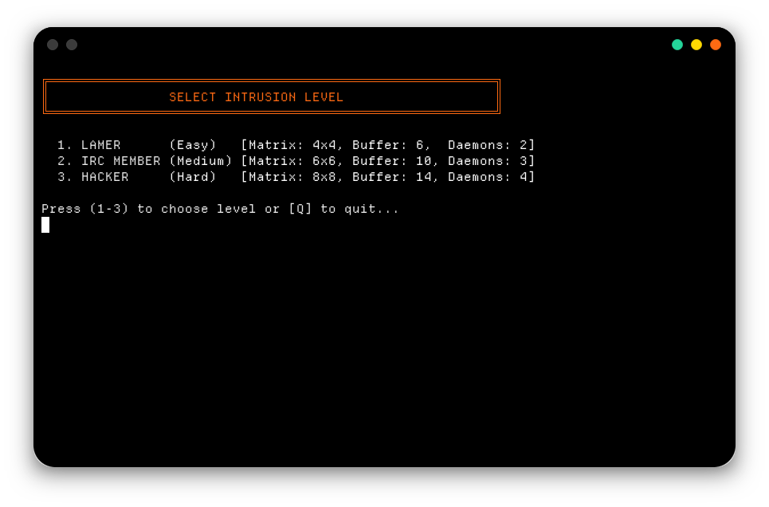
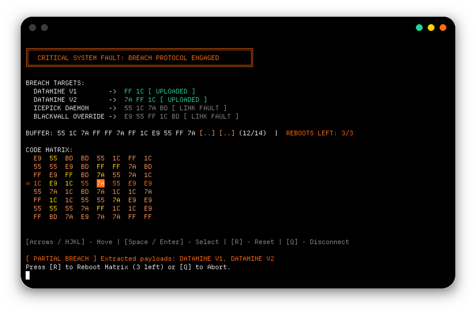

# breachpy
### Famous "Breach protocol" puzzle game from "Cyberpunk 2077" in your terminal

 



## UI

- Fancy TUI with 'cyberpunk-style' color scheme



- 3 Difficulty levels



- Easy controls by arrows or Vim navigation keys (H J K L)



## Installation

### Via pip/pipx [Soon]

1. Make sure you have [python](https://www.python.org/downloads/) installed in your system

2. 
   - **Windows (cmd|powershell):**

    ```shell
    pip install breachpy
    ```
   - **Linux|macOS|FreeBSD|OpenBSD (bash|zsh|fish or any):** (Make sure you have [pipx](https://pipx.pypa.io/stable/how-to/install-pipx/) installed)
    ```bash
    pipx install breachpy
    ```
3. Run the game and have fun!
```shell
breachpy
```

### Manual execution (from source)

1. Clone the repository: **Be sure you have installed [python](https://www.python.org/downloads/) and [git](https://git-scm.com/install/linux)**
```shell
git clone https://codeberg.org/Y-Akamirsky/breachpy
```
2. Then change directory to the project folder
```shell
cd breachpy
```
3. Run the game as module using Python's module flag:
```shell
python -m src.breachpy.main
```
4. Have Fun!

## Contributing
- Contributions are welcome! Feel free to open Issues or submit Pull Requests. I'll highly appreciate it!

## Built With
- Python
- Some vibecode
- Some interest
- For fun
